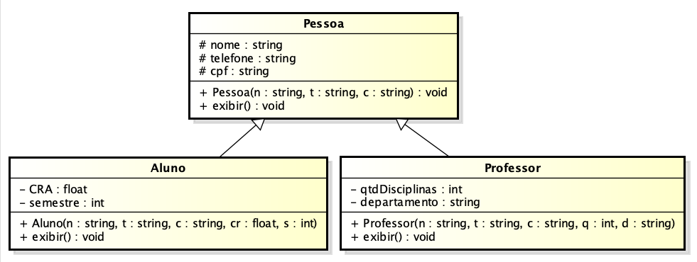

# Exercício C++ - Herança de Classes

---
## Resumo

<b>Essa questão foi retirada do Repositório de questões LOP, utilizado por cursos da UFRN</b>. Para resolução, escolhi a linguagem C++ que estou aprendendo atualmente. Foram usados conhecimentos de:

- Herança
- Alocação Dinâmica
- Orientação a Objetos
- Modularização de Código

---

## Execução

Para executar e compilar o programa é necessário possuir algum compilador instalado e configurada no computador de execução. O compilador utilizado para compilar foi o MinGW.
É necessário compilar todos os arquivos .cpp separadamente para a execução do programa:
```
g++ ./src/main.cpp ./src/Pessoa/Pessoa.cpp ./src/Aluno/Aluno.cpp ./src/Professor/Professor.cpp -o main.exe
```

Para encurtar o comando de compilação eu desenvolvi 2 scripts que facilitam e executam o programa simultaneamente <a href="./start.bat">start.bat</a> e <a href="./package.json">package.json</a>

### package.json

Para executar é necessário ter o Node.js instalado e configurado no computador.

### start.bat

Para executar é necessário apenas que escreva o comando "start.bat" no cmd no diretório em que o arquivo se encontra.

### main.exe

Outra opção de execução do programa é por meio do comando "main.exe" no cmd. O benefício é que não será necessário ter algum compilador instalado. Porém, a limitação desse método é que não será possível alterar os valores passados nas instanciações das classes no arquivo <a href="./src/main.cpp">main.cpp</a>, sendo necessário compilar o programa novamente para alterar os valores de acordo com o desejo do usuário

---

## Descrição

Crie um sistema educacional para uma escola com as classes Pessoa e classes derivadas (herença) Aluno e Professor, de acordo com o diagrama de classes apresentado:



A classe Pessoa tem os atributos protected nome, telefone, cpf; e o método exibir(), que exibe todos seus atributos.

A classe Aluno possui os atributos privados, CRA e semestre. A classe Professor deve possuir os atributos privados qtdDisciplinas e departamento. Ambas classes devem possuir as seguintes especificações:​

- Em seu construtor, inicie seus atributos e chame o construtor da superclasse para iniciar os demais atributos.
- ​void exibir(). Método a ser sobrescrito que exibe todos os atributos da classe e da superclasse.


Crie um programa principal que recebe uma Pessoa, um Aluno e um Professor.
Por fim, e exiba todas as informações dos objetos, utilizando o método exibir(), de acordo com a saída esperada.

<i>Código da Questão no LOP: 586fed4529</i>
